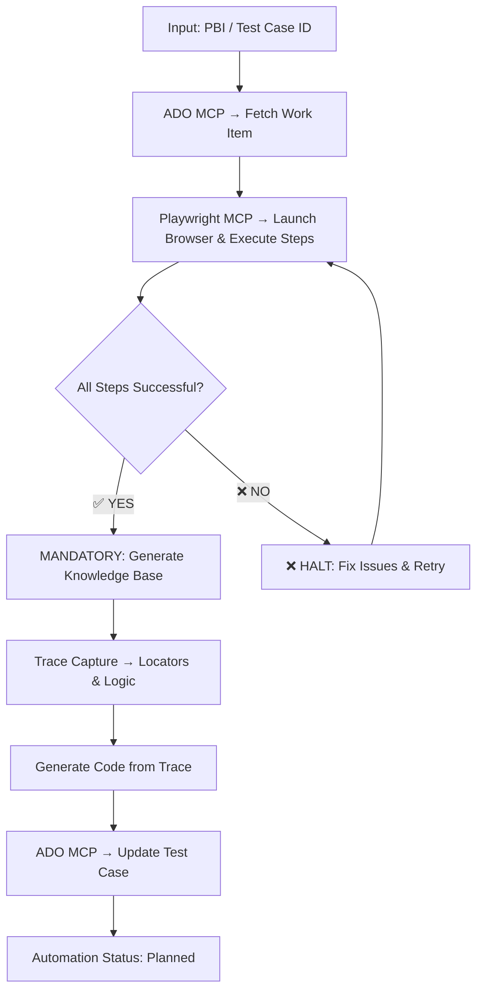

# 🎯 Refined Test Case-Based Automation Workflow

This rule defines the **simplified end-to-end automation process** for taking a single Test Case ID and creating fully automated test execution using Azure DevOps MCP and Playwright MCP servers.

---

## 📋 Process Overview

**Input**: Test Case ID (e.g., "Automate test case 2124193")
**Output**: Automated test scenario with dynamic locators and ADO updates

### 🔄 5-Phase Simplified Automation Flow



### ⚠️ **CRITICAL WORKFLOW REQUIREMENT**
> **Knowledge Base Generation is MANDATORY after successful live execution**
> 
> - ✅ **Trigger**: ALL Gherkin steps complete successfully  
> - 🔒 **Validation**: No failed steps, no incomplete steps
> - 📊 **Output**: Comprehensive JSON knowledge base with locator strategies
> - ⛔ **Failure**: Automation workflow HALTS if knowledge base generation fails

---

## 🏗️ Phase 1: Azure DevOps Analysis & Context Discovery

### Step 1: Extract Test Case Information
```typescript
// Simplified: Extract essential test case details
const testCase = await mcp_AzureDevOps_getWorkItem({ id: testCaseId });
const testCaseDetails = {
    id: testCase.id,
    title: testCase.fields["System.Title"],
    description: testCase.fields["System.Description"],
    steps: testCase.fields["Microsoft.VSTS.TCM.Steps"],
    automationStatus: testCase.fields["Microsoft.VSTS.TCM.AutomationStatus"],
    assignedTo: testCase.fields["System.AssignedTo"],
    state: testCase.fields["System.State"]
};

console.log(`📋 Test Case ${testCaseId}: ${testCaseDetails.title}`);
```

### Step 2: Auto-Detect Target Feature File
```typescript
// Auto-detect feature file based on test case title
const targetFeatureFile = autoDetectFeatureFile(testCaseDetails.title);

function autoDetectFeatureFile(title) {
    if (title.toLowerCase().includes('doctracker') || title.toLowerCase().includes('document tracker')) {
        return 'Features/DocumentTracker/DocumentTrackerAgGrid.feature';
    }
    if (title.toLowerCase().includes('upload')) {
        return 'Features/Upload/UploadFiles.feature';
    }
    // Add more patterns as needed
    return 'Features/General/GeneralTests.feature';
}

console.log(`📁 Target feature file: ${targetFeatureFile}`);
```

---

## 📝 Phase 2: Feature File Integration & Scenario Generation

### Step 1: Convert ADO Steps to Gherkin
```typescript
// Convert test case steps to Gherkin scenario
function convertADOStepsToGherkin(testCaseDetails) {
    const steps = parseADOTestSteps(testCaseDetails.steps);
    const tags = [
        `@TestCase_${testCaseDetails.id}`,
        '@Medium',
        `@${determineFunctionalTag(testCaseDetails.title)}`
    ];
    
    const gherkinSteps = steps.map(step => {
        const action = step.action.toLowerCase();
        
        if (action.includes('navigate') || action.includes('open')) {
            return `Given I navigate to the Document Tracker`;
        } else if (action.includes('select') && action.includes('tax year')) {
            return `When I select the tax year "2024" from the tax year dropdown`;
        } else if (action.includes('select') && action.includes('view')) {
            return `When I select a view "Playwright Test Client View" from the dropdown`;
        } else if (action.includes('select') && action.includes('rows')) {
            return `When I select the first 2 rows in the Document Tracker grid`;
        } else if (action.includes('click') && action.includes('button')) {
            return `When I click on the 'x' button of the "2 rows selected" pill`;
        } else if (action.includes('verify') || action.includes('should')) {
            return `Then I should see "${extractExpectedResult(step.expectedResult)}" displayed correctly`;
        } else {
            return `And ${cleanStepText(step.action)}`;
        }
    });
    
    return {
        tags: tags.join(' '),
        title: testCaseDetails.title,
        steps: gherkinSteps
    };
}
```

### Step 2: Integrate Scenario into Feature File
```typescript
// Add scenario to target feature file
async function integrateScenarioIntoFeatureFile(featureFilePath, gherkinScenario) {
    const existingContent = await readFile(featureFilePath);
    const newScenario = `
  ${gherkinScenario.tags}
  Scenario: ${gherkinScenario.title}
${gherkinScenario.steps.map(step => `    ${step}`).join('\n')}
`;
    
    const updatedContent = existingContent + '\n' + newScenario;
    await writeFile(featureFilePath, updatedContent);
    
    console.log(`✅ Scenario added to ${featureFilePath}`);
}
```

---

## 🎭 Phase 3: Playwright MCP → Launch Browser & Execute Steps with Dynamic Trace Capture

### Step 1: Initialize Browser and Dynamic Locator Capture
```csharp
// Launch browser and initialize dynamic locator knowledge base
public async Task<DynamicLocatorKnowledgeBase> ExecuteLiveAndCaptureLocators(int testCaseId, string featureFile)
{
    Console.WriteLine($"🎭 Launching browser for Test Case {testCaseId}");
    
    // Launch browser
    await mcp_PlaywrightEnhanced_browser_navigate({ 
        url: "https://dataflow-qa.pwcinternal.com/" 
    });
    
    var knowledgeBase = new DynamicLocatorKnowledgeBase {
        TestCaseId = testCaseId,
        CapturedLocators = new Dictionary<string, DynamicLocator>(),
        InteractionTrace = new List<InteractionStep>(),
        SessionStartTime = DateTime.Now
    };
    
    Console.WriteLine($"📚 Dynamic locator capture initialized");
    return knowledgeBase;
}
```

### Step 2: Execute Steps and Capture Dynamic Locators
```csharp
// Execute each Gherkin step and capture locators dynamically
public async Task ExecuteStepsWithDynamicCapture(DynamicLocatorKnowledgeBase knowledgeBase, List<GherkinStep> steps)
{
    Console.WriteLine($"🎯 Executing {steps.Count} steps and capturing dynamic locators");
    
    foreach (var step in steps)
    {
        var interaction = await ExecuteStepAndCaptureLocators(step);
        knowledgeBase.InteractionTrace.Add(interaction);
        
        // 🔍 DYNAMIC LOCATOR CAPTURE: Store multiple selector strategies
        if (interaction.DiscoveredElement != null)
        {
            var elementKey = GenerateElementKey(interaction.ElementDescription);
            knowledgeBase.CapturedLocators[elementKey] = new DynamicLocator {
                ElementDescription = interaction.ElementDescription,
                PrimarySelector = interaction.DiscoveredElement.BestSelector,
                AlternativeSelectors = interaction.DiscoveredElement.AlternativeSelectors,
                ElementType = interaction.DiscoveredElement.Type,
                ConfidenceScore = interaction.DiscoveredElement.Confidence,
                CapturedDuringStep = step.StepText,
                DiscoveryMethods = interaction.DiscoveredElement.DiscoveryMethods
            };
            
            Console.WriteLine($"🔍 Captured locator for: {interaction.ElementDescription}");
            Console.WriteLine($"   Primary: {interaction.DiscoveredElement.BestSelector}");
            Console.WriteLine($"   Alternatives: {interaction.DiscoveredElement.AlternativeSelectors.Count}");
        }
    }
    
    Console.WriteLine($"📊 Captured {knowledgeBase.CapturedLocators.Count} dynamic locators");
    
    // ⚠️ MANDATORY: Generate Knowledge Base after all steps complete successfully
    Console.WriteLine($"🔍 All {steps.Count} Gherkin steps executed - triggering mandatory Knowledge Base generation");
    await CompleteLiveExecution(knowledgeBase);
}

// Execute individual step and capture locator information
private async Task<InteractionStep> ExecuteStepAndCaptureLocators(GherkinStep step)
{
    var interaction = new InteractionStep {
        StepText = step.Text,
        ActionType = step.ActionType,
        ElementDescription = step.Target,
        StartTime = DateTime.Now
    };
    
    try
    {
        if (step.ActionType == "click")
        {
            // Get page snapshot for dynamic discovery
            var pageSnapshot = await mcp_PlaywrightEnhanced_browser_snapshot();
            
            // Discover element using multiple strategies
            var discoveredElement = await DiscoverElementDynamically(step.Target, pageSnapshot);
            
            // Execute the click using best discovered selector
            await mcp_PlaywrightEnhanced_browser_click({
                element: step.Target,
                ref: discoveredElement.BestRef
            });
            
            interaction.DiscoveredElement = discoveredElement;
            interaction.Success = true;
        }
        else if (step.ActionType == "fill")
        {
            var pageSnapshot = await mcp_PlaywrightEnhanced_browser_snapshot();
            var discoveredElement = await DiscoverElementDynamically(step.Target, pageSnapshot);
            
            await mcp_PlaywrightEnhanced_browser_type({
                element: step.Target,
                ref: discoveredElement.BestRef,
                text: step.Value
            });
            
            interaction.DiscoveredElement = discoveredElement;
            interaction.Success = true;
        }
        else if (step.ActionType == "navigation")
        {
            await mcp_PlaywrightEnhanced_browser_navigate({ url: step.Target });
            interaction.Success = true;
        }
        
        interaction.EndTime = DateTime.Now;
        Console.WriteLine($"✅ Step executed: {step.Text}");
        return interaction;
    }
    catch (Exception ex)
    {
        interaction.Error = ex.Message;
        interaction.Success = false;
        interaction.EndTime = DateTime.Now;
        Console.WriteLine($"❌ Step failed: {step.Text} - {ex.Message}");
        return interaction;
    }
}
```

### Step 3: Dynamic Element Discovery with Multiple Strategies
```csharp
// Discover element using multiple locator strategies for maximum resilience
private async Task<DiscoveredElement> DiscoverElementDynamically(string description, object pageSnapshot)
{
    Console.WriteLine($"🔍 Discovering element: {description}");
    
    var element = new DiscoveredElement {
        Description = description,
        AlternativeSelectors = new List<string>(),
        DiscoveryMethods = new List<string>(),
        ConfidenceScores = new List<double>()
    };
    
    // Strategy 1: Text-based discovery (highest priority for UI resilience)
    var textSelector = await FindByVisibleText(description, pageSnapshot);
    if (textSelector != null) {
        element.AlternativeSelectors.Add(textSelector);
        element.DiscoveryMethods.Add("text-based");
        element.ConfidenceScores.Add(0.9);
    }
    
    // Strategy 2: Role-based discovery (accessibility-focused)
    var roleSelector = await FindByRole(description, pageSnapshot);
    if (roleSelector != null) {
        element.AlternativeSelectors.Add(roleSelector);
        element.DiscoveryMethods.Add("role-based");
        element.ConfidenceScores.Add(0.85);
    }
    
    // Strategy 3: Contextual discovery (parent/sibling relationships)
    var contextSelector = await FindByContext(description, pageSnapshot);
    if (contextSelector != null) {
        element.AlternativeSelectors.Add(contextSelector);
        element.DiscoveryMethods.Add("contextual");
        element.ConfidenceScores.Add(0.95);
    }
    
    // Strategy 4: Attribute-based discovery (ref, data-testid, etc.)
    var attributeSelector = await FindByAttributes(description, pageSnapshot);
    if (attributeSelector != null) {
        element.AlternativeSelectors.Add(attributeSelector);
        element.DiscoveryMethods.Add("attribute-based");
        element.ConfidenceScores.Add(0.8);
    }
    
    // Select best selector based on confidence and context
    var bestIndex = element.ConfidenceScores.IndexOf(element.ConfidenceScores.Max());
    element.BestSelector = element.AlternativeSelectors[bestIndex];
    element.BestRef = await ExtractRefFromSelector(element.BestSelector, pageSnapshot);
    element.Type = await DetermineElementType(element.BestSelector, pageSnapshot);
    element.Confidence = element.ConfidenceScores[bestIndex];
    
    Console.WriteLine($"✅ Element discovered with {element.AlternativeSelectors.Count} strategies");
    Console.WriteLine($"   Best: {element.BestSelector} (confidence: {element.Confidence})");
    
    return element;
}
```

### Step 4: **MANDATORY** Dynamic Locator Knowledge Base Generation
```csharp
// ⚠️ MANDATORY: This step MUST be executed after ALL Gherkin steps complete successfully
// Save the captured knowledge base to JSON file for Phase 4 code generation
private async Task SaveDynamicLocatorKnowledgeBase(DynamicLocatorKnowledgeBase knowledgeBase)
{
    Console.WriteLine($"🔍 MANDATORY STEP: Validating test execution completion before knowledge base generation");
    
    // ✅ VALIDATION: Ensure all Gherkin steps executed successfully
    await ValidateAllStepsCompletedSuccessfully(knowledgeBase);
    
    Console.WriteLine($"💾 Saving Dynamic Locator Knowledge Base for Test Case {knowledgeBase.TestCaseId}");
    
    // Create KnowledgeBase directory if it doesn't exist
    var knowledgeBaseDir = "KnowledgeBase";
    if (!Directory.Exists(knowledgeBaseDir))
    {
        Directory.CreateDirectory(knowledgeBaseDir);
        Console.WriteLine($"📁 Created KnowledgeBase directory: {knowledgeBaseDir}");
    }
    
    // Generate knowledge base file name
    var fileName = $"TestCase_{knowledgeBase.TestCaseId}_DynamicLocators.json";
    var filePath = Path.Combine(knowledgeBaseDir, fileName);
    
    // Enhance knowledge base with metadata
    var enhancedKnowledgeBase = new {
        TestCaseId = knowledgeBase.TestCaseId.ToString(),
        TestTitle = GetTestCaseTitle(knowledgeBase.TestCaseId),
        CaptureDate = DateTime.Now.ToString("yyyy-MM-ddTHH:mm:ssZ"),
        CapturedLocators = knowledgeBase.CapturedLocators.ToDictionary(
            kvp => kvp.Key,
            kvp => new {
                ElementDescription = kvp.Value.ElementDescription,
                PrimarySelector = kvp.Value.BestSelector,
                AlternativeSelectors = kvp.Value.AlternativeSelectors,
                DiscoveryMethods = kvp.Value.DiscoveryMethods,
                ConfidenceScore = kvp.Value.ConfidenceScore,
                ElementType = kvp.Value.ElementType,
                InteractionType = DetermineInteractionType(kvp.Value),
                SelfHealingCapable = kvp.Value.AlternativeSelectors.Count > 1,
                ValidationSelector = GenerateValidationSelector(kvp.Value),
                ExpectedState = DetermineExpectedState(kvp.Value)
            }
        ),
        InteractionTrace = knowledgeBase.InteractionTrace.Select((interaction, index) => new {
            StepNumber = index + 1,
            StepText = interaction.StepText,
            ActionType = interaction.ActionType,
            ElementUsed = interaction.ElementDescription,
            Status = interaction.Success ? "success" : "failed",
            ExecutionTime = interaction.StartTime.ToString("yyyy-MM-ddTHH:mm:ssZ"),
            ValidationResult = interaction.ValidationResult,
            Notes = interaction.Error ?? interaction.Notes
        }),
        TestStepsRemaining = ExtractRemainingSteps(knowledgeBase),
        SelfHealingCapabilities = new {
            FallbackStrategies = new[] {
                "Text-based discovery for dynamic elements",
                "Contextual selectors for grid interactions", 
                "Multiple selector attempts with confidence scoring",
                "Ref-based selectors as backup for stable elements"
            },
            ConfidenceThreshold = 0.8,
            MaxRetryAttempts = 3
        }
    };
    
    // Serialize and save to JSON file
    var jsonOptions = new JsonSerializerOptions { 
        WriteIndented = true,
        PropertyNamingPolicy = JsonNamingPolicy.CamelCase
    };
    var jsonContent = JsonSerializer.Serialize(enhancedKnowledgeBase, jsonOptions);
    
    await File.WriteAllTextAsync(filePath, jsonContent);
    
    Console.WriteLine($"✅ Knowledge Base saved successfully:");
    Console.WriteLine($"   📄 File: {filePath}");
    Console.WriteLine($"   🎯 Locators Captured: {knowledgeBase.CapturedLocators.Count}");
    Console.WriteLine($"   📋 Interaction Steps: {knowledgeBase.InteractionTrace.Count}");
    Console.WriteLine($"   🔧 Ready for Phase 4 Code Generation");
    
    return filePath;
}

// Helper method to extract remaining test steps for continuation
private List<string> ExtractRemainingSteps(DynamicLocatorKnowledgeBase knowledgeBase)
{
    // Analyze the interaction trace to determine what steps are still pending
    var completedSteps = knowledgeBase.InteractionTrace.Select(i => i.StepText).ToList();
    var allSteps = GetAllTestStepsFromFeatureFile(knowledgeBase.TestCaseId);
    
    return allSteps.Where(step => !completedSteps.Any(completed => 
        completed.Contains(step) || step.Contains(completed))).ToList();
}

// ⚠️ MANDATORY VALIDATION: Ensure all Gherkin steps completed successfully before knowledge base generation
private async Task ValidateAllStepsCompletedSuccessfully(DynamicLocatorKnowledgeBase knowledgeBase)
{
    Console.WriteLine($"🔍 Validating all Gherkin steps completed successfully for Test Case {knowledgeBase.TestCaseId}");
    
    // Check for any failed steps
    var failedSteps = knowledgeBase.InteractionTrace.Where(i => !i.Success).ToList();
    if (failedSteps.Any())
    {
        var failedStepDetails = string.Join("\n", failedSteps.Select(f => $"   ❌ {f.StepText}: {f.ErrorDetails}"));
        throw new InvalidOperationException($"❌ Cannot generate Knowledge Base - {failedSteps.Count} steps failed:\n{failedStepDetails}\n\n⚠️ All Gherkin steps must complete successfully before Knowledge Base generation.");
    }
    
    // Check for incomplete execution
    var remainingSteps = ExtractRemainingSteps(knowledgeBase);
    if (remainingSteps.Any())
    {
        var remainingStepsList = string.Join("\n", remainingSteps.Select(s => $"   ⏳ {s}"));
        throw new InvalidOperationException($"❌ Cannot generate Knowledge Base - {remainingSteps.Count} steps incomplete:\n{remainingStepsList}\n\n⚠️ ALL Gherkin steps must be executed before Knowledge Base generation.");
    }
    
    // Validate minimum interaction requirements
    if (knowledgeBase.InteractionTrace.Count == 0)
    {
        throw new InvalidOperationException($"❌ Cannot generate Knowledge Base - No interaction trace found. At least one successful step execution is required.");
    }
    
    var successfulSteps = knowledgeBase.InteractionTrace.Where(i => i.Success).ToList();
    if (successfulSteps.Count == 0)
    {
        throw new InvalidOperationException($"❌ Cannot generate Knowledge Base - No successful steps found. At least one step must complete successfully.");
    }
    
    // ✅ VALIDATION PASSED
    Console.WriteLine($"✅ VALIDATION PASSED: All {knowledgeBase.InteractionTrace.Count} Gherkin steps completed successfully");
    Console.WriteLine($"   📊 Successful Steps: {successfulSteps.Count}/{knowledgeBase.InteractionTrace.Count}");
    Console.WriteLine($"   🎯 Captured Locators: {knowledgeBase.CapturedLocators.Count}");
    Console.WriteLine($"   ✅ Ready for mandatory Knowledge Base generation");
}
```

**🎯 End of Phase 3 Summary:**
- ✅ Browser launched and authenticated
- ✅ Live scenario execution with dynamic element discovery  
- ✅ Multiple locator strategies captured with confidence scoring
- ✅ Interaction trace recorded with success/failure status
- ⚠️ **MANDATORY: All Gherkin steps validation completed successfully**
- ✅ **Dynamic Locator Knowledge Base automatically generated and saved to JSON file**
- ✅ Ready for Phase 4 intelligent code integration

### 🔒 **CRITICAL REQUIREMENT**: Knowledge Base Generation
> **The Dynamic Locator Knowledge Base MUST be generated after EVERY successful live execution where ALL Gherkin steps complete successfully. This is NOT optional - it is a mandatory step that ensures:**
> - **Comprehensive locator documentation** for future maintenance
> - **Self-healing automation capabilities** through fallback strategies  
> - **Quality metrics and confidence scoring** for automation reliability
> - **Complete execution traceability** for debugging and optimization
> - **Automatic code generation readiness** for Phase 4

### ⚡ **Automated Knowledge Base Generation Trigger:**
```csharp
// This is automatically called at the end of Phase 3 execution
public async Task CompleteLiveExecution(DynamicLocatorKnowledgeBase knowledgeBase)
{
    try 
    {
        Console.WriteLine($"🎯 Phase 3 Live Execution completed for Test Case {knowledgeBase.TestCaseId}");
        
        // ⚠️ MANDATORY: Generate Knowledge Base if all steps successful
        await SaveDynamicLocatorKnowledgeBase(knowledgeBase);
        
        Console.WriteLine($"✅ Phase 3 COMPLETED with Knowledge Base generated successfully");
        Console.WriteLine($"🔧 Ready to proceed to Phase 4: Intelligent Code Integration");
    }
    catch (Exception ex)
    {
        Console.WriteLine($"❌ Phase 3 FAILED: {ex.Message}");
        Console.WriteLine($"⚠️ Knowledge Base generation skipped due to validation failure");
        throw; // Re-throw to halt automation workflow
    }
}
```

---

## 🔧 Phase 4: Intelligent Code Integration from Trace

### Step 1: Load Knowledge Base and Analyze Existing Codebase Structure
```csharp
// Load the saved knowledge base and intelligently analyze existing codebase for code integration
public async Task GenerateCodeFromDynamicLocators(int testCaseId)
{
    Console.WriteLine($"🔧 Loading Knowledge Base for Test Case {testCaseId}");
    
    // Load the knowledge base from JSON file created in Phase 3
    var knowledgeBase = await LoadDynamicLocatorKnowledgeBase(testCaseId);
    
    await GenerateCodeFromLoadedKnowledgeBase(knowledgeBase);
}

// Load the Dynamic Locator Knowledge Base from JSON file
private async Task<DynamicLocatorKnowledgeBase> LoadDynamicLocatorKnowledgeBase(int testCaseId)
{
    var fileName = $"TestCase_{testCaseId}_DynamicLocators.json";
    var filePath = Path.Combine("KnowledgeBase", fileName);
    
    if (!File.Exists(filePath))
    {
        throw new FileNotFoundException($"Knowledge Base file not found: {filePath}. Ensure Phase 3 completed successfully.");
    }
    
    Console.WriteLine($"📖 Loading Knowledge Base from: {filePath}");
    
    var jsonContent = await File.ReadAllTextAsync(filePath);
    var knowledgeBaseData = JsonSerializer.Deserialize<dynamic>(jsonContent);
    
    // Convert back to DynamicLocatorKnowledgeBase object
    var knowledgeBase = new DynamicLocatorKnowledgeBase
    {
        TestCaseId = testCaseId,
        CapturedLocators = new Dictionary<string, DynamicLocator>(),
        InteractionTrace = new List<InteractionStep>()
    };
    
    // Parse captured locators from JSON
    foreach (var locatorData in knowledgeBaseData.CapturedLocators)
    {
        var locator = new DynamicLocator
        {
            ElementDescription = locatorData.Value.ElementDescription,
            BestSelector = locatorData.Value.PrimarySelector,
            AlternativeSelectors = locatorData.Value.AlternativeSelectors.ToList(),
            DiscoveryMethods = locatorData.Value.DiscoveryMethods.ToList(),
            ConfidenceScore = locatorData.Value.ConfidenceScore,
            ElementType = locatorData.Value.ElementType
        };
        
        knowledgeBase.CapturedLocators[locatorData.Key] = locator;
    }
    
    Console.WriteLine($"✅ Knowledge Base loaded successfully:");
    Console.WriteLine($"   🎯 Locators: {knowledgeBase.CapturedLocators.Count}");
    Console.WriteLine($"   📋 Interaction Steps: {knowledgeBaseData.InteractionTrace.Count}");
    
    return knowledgeBase;
}

// Generate code from the loaded knowledge base
private async Task GenerateCodeFromLoadedKnowledgeBase(DynamicLocatorKnowledgeBase knowledgeBase)
{
    Console.WriteLine("🔧 Analyzing existing codebase structure for intelligent code integration");
    
    var functionalArea = DetermineFunctionalArea(knowledgeBase.TestCaseId);
    
    // Step 1: Analyze existing folder structure and locate target files
    var codeStructure = await AnalyzeExistingCodeStructure(functionalArea);
    
    // Step 2: Intelligently integrate Page Object methods without duplication
    await IntelligentlyIntegratePageObjectMethods(functionalArea, knowledgeBase, codeStructure);
    
    // Step 3: Intelligently integrate Step Definitions without duplication  
    await IntelligentlyIntegrateStepDefinitions(functionalArea, knowledgeBase, codeStructure);
    
    // Step 4: Save knowledge base for reference
    await SaveKnowledgeBase(knowledgeBase);
}

// Analyze existing codebase structure to understand where to place new code
private async Task<CodeStructure> AnalyzeExistingCodeStructure(string functionalArea)
{
    Console.WriteLine($"🔍 Analyzing codebase structure for {functionalArea}");
    
    var structure = new CodeStructure
    {
        PageObjectPaths = new List<string>(),
        StepDefinitionPaths = new List<string>(),
        ExistingMethods = new List<MethodInfo>(),
        ExistingSelectors = new List<SelectorInfo>(),
        ExistingSteps = new List<StepInfo>()
    };
    
    // Find existing Page Object files using multiple search patterns
    var pageObjectCandidates = new[]
    {
        $"Pages/{functionalArea}/{functionalArea}Page.cs",
        $"Pages/{functionalArea}Page.cs",
        $"PageObjects/{functionalArea}/{functionalArea}Page.cs",
        $"PageObjects/{functionalArea}Page.cs",
        $"src/Pages/{functionalArea}Page.cs",
        $"Pages/{functionalArea}/{functionalArea}.cs"
    };
    
    foreach (var candidate in pageObjectCandidates)
    {
        if (await FileExists(candidate))
        {
            structure.PageObjectPaths.Add(candidate);
            structure.ExistingMethods.AddRange(await ExtractExistingMethods(candidate));
            structure.ExistingSelectors.AddRange(await ExtractExistingSelectors(candidate));
            Console.WriteLine($"📄 Found existing Page Object: {candidate}");
        }
    }
    
    // Find existing Step Definition files using multiple search patterns
    var stepDefCandidates = new[]
    {
        $"StepDefinitions/{functionalArea}/{functionalArea}Steps.cs",
        $"StepDefinitions/{functionalArea}Steps.cs",
        $"Steps/{functionalArea}/{functionalArea}Steps.cs",
        $"Steps/{functionalArea}Steps.cs",
        $"src/StepDefinitions/{functionalArea}Steps.cs",
        $"StepDefinitions/{functionalArea}.cs"
    };
    
    foreach (var candidate in stepDefCandidates)
    {
        if (await FileExists(candidate))
        {
            structure.StepDefinitionPaths.Add(candidate);
            structure.ExistingSteps.AddRange(await ExtractExistingStepMethods(candidate));
            Console.WriteLine($"📄 Found existing Step Definitions: {candidate}");
        }
    }
    
    Console.WriteLine($"✅ Analysis complete: {structure.PageObjectPaths.Count} Page Objects, {structure.StepDefinitionPaths.Count} Step Definition files");
    return structure;
}

### Step 2: Intelligently Integrate Page Object Methods (Avoid Duplication)
```csharp
// Intelligently integrate new Page Object methods into existing files without creating duplicates
private async Task IntelligentlyIntegratePageObjectMethods(string functionalArea, DynamicLocatorKnowledgeBase knowledgeBase, CodeStructure codeStructure)
{
    Console.WriteLine($"🧩 Intelligently integrating Page Object methods for {functionalArea}");
    
    // Determine target Page Object file (existing or new)
    var targetPageFile = codeStructure.PageObjectPaths.FirstOrDefault() ?? $"Pages/{functionalArea}/{functionalArea}Page.cs";
    var pageExists = codeStructure.PageObjectPaths.Any();
    
    if (!pageExists)
    {
        Console.WriteLine($"📁 Creating new Page Object file: {targetPageFile}");
        await EnsureDirectoryExists(Path.GetDirectoryName(targetPageFile));
        await CreateNewPageObjectFile(targetPageFile, functionalArea, knowledgeBase);
        return;
    }
    
    Console.WriteLine($"📄 Integrating into existing Page Object: {targetPageFile}");
    var pageContent = await File.ReadAllTextAsync(targetPageFile);
    
    var newSelectors = new List<string>();
    var newMethods = new List<string>();
    
    // Analyze discovered elements and check for existing implementations
    foreach (var locator in knowledgeBase.CapturedLocators)
    {
        var methodName = ToMethodName(locator.Key);
        var selectorName = ToSelectorName(locator.Key);
        
        // Check if similar method already exists (avoid duplication)
        var existingMethod = codeStructure.ExistingMethods.FirstOrDefault(m => 
            m.Name.Equals(methodName, StringComparison.OrdinalIgnoreCase) ||
            m.Name.Contains(methodName, StringComparison.OrdinalIgnoreCase) ||
            methodName.Contains(m.Name, StringComparison.OrdinalIgnoreCase) ||
            CalculateSimilarity(m.Name, methodName) > 0.8);
        
        if (existingMethod != null)
        {
            Console.WriteLine($"♻️ Reusing existing method: {existingMethod.Name} for {locator.Value.ElementDescription}");
            continue;
        }
        
        // Check if similar selector already exists
        var existingSelector = codeStructure.ExistingSelectors.FirstOrDefault(s => 
            s.Value.Contains(locator.Value.PrimarySelector) || 
            locator.Value.AlternativeSelectors.Any(alt => s.Value.Contains(alt)) ||
            s.Name.Equals(selectorName, StringComparison.OrdinalIgnoreCase));
        
        if (existingSelector != null)
        {
            Console.WriteLine($"♻️ Enhancing existing selector: {existingSelector.Name} with fallbacks for {locator.Value.ElementDescription}");
            await EnhanceExistingSelector(targetPageFile, existingSelector, locator.Value);
            continue;
        }
        
        // Generate new unique selector with fallback strategies
        var selectorCode = GenerateSelectorWithFallbacks(selectorName, locator.Value);
        newSelectors.Add(selectorCode);
        
        // Generate new method with intelligent interaction detection
        var methodCode = GenerateIntelligentMethod(methodName, selectorName, locator.Value);
        newMethods.Add(methodCode);
    }
    
    // Integrate new selectors and methods into existing file
    if (newSelectors.Any() || newMethods.Any())
    {
        await IntegrateIntoExistingPageObject(targetPageFile, pageContent, newSelectors, newMethods, knowledgeBase.TestCaseId);
        Console.WriteLine($"✅ Integrated {newSelectors.Count} selectors and {newMethods.Count} methods into {targetPageFile}");
    }
    else
    {
        Console.WriteLine($"✅ All required functionality already exists - no duplication needed");
    }
}

// Generate selector with intelligent fallback strategies
private string GenerateSelectorWithFallbacks(string selectorName, DynamicLocator locator)
{
    var selectorCode = new StringBuilder();
    selectorCode.AppendLine($"        // {locator.ElementDescription} - Self-healing selector strategies");
    selectorCode.AppendLine($"        private readonly string _{selectorName}Selector = \"{locator.PrimarySelector}\";");
    
    for (int i = 0; i < locator.AlternativeSelectors.Count; i++)
    {
        selectorCode.AppendLine($"        private readonly string _{selectorName}Alt{i + 1}Selector = \"{locator.AlternativeSelectors[i]}\"; // Strategy: {locator.DiscoveryMethods.ElementAtOrDefault(i + 1) ?? "fallback"}");
    }
    
    return selectorCode.ToString();
}

// Generate intelligent method based on element type and interaction patterns
private string GenerateIntelligentMethod(string methodName, string selectorName, DynamicLocator locator)
{
    var interactionType = DetermineInteractionType(locator);
    var parameterInfo = GenerateMethodParameters(locator, interactionType);
    
    var methodCode = $@"        /// <summary>
        /// {locator.ElementDescription}
        /// Generated from Test Case knowledge base with self-healing capabilities
        /// Element Type: {locator.ElementType} | Confidence: {locator.ConfidenceScore:F2}
        /// Captured during: {locator.CapturedDuringStep}
        /// </summary>
        public async Task {methodName}({parameterInfo.Parameters})
        {{
            var selectors = new[] {{ 
                _{selectorName}Selector{string.Join("", Enumerable.Range(1, locator.AlternativeSelectors.Count).Select(i => $", _{selectorName}Alt{i}Selector"))}
            }};
            
            foreach (var selector in selectors)
            {{
                try
                {{
{GenerateInteractionCode(interactionType, parameterInfo.ParameterUsage)}
                    Console.WriteLine($""✅ Successfully interacted with {locator.ElementDescription} using selector: {{selector}}"");
                    return;
                }}
                catch (Exception ex)
                {{
                    Console.WriteLine($""⚠️ Selector failed for {locator.ElementDescription}, trying next fallback: {{ex.Message}}"");
                    continue;
                }}
            }}
            
            throw new ElementNotFoundException($""Could not find element: {locator.ElementDescription} using any fallback strategy"");
        }}";
    
    return methodCode;
}
```

### Step 3: Intelligently Integrate Step Definitions (Avoid Duplication)
```csharp
// Intelligently integrate Step Definitions into existing files without creating duplicates
private async Task IntelligentlyIntegrateStepDefinitions(string functionalArea, DynamicLocatorKnowledgeBase knowledgeBase, CodeStructure codeStructure)
{
    Console.WriteLine($"🧩 Intelligently integrating Step Definitions for {functionalArea}");
    
    // Determine target Step Definition file (existing or new)
    var targetStepFile = codeStructure.StepDefinitionPaths.FirstOrDefault() ?? $"StepDefinitions/{functionalArea}/{functionalArea}Steps.cs";
    var stepFileExists = codeStructure.StepDefinitionPaths.Any();
    
    if (!stepFileExists)
    {
        Console.WriteLine($"📁 Creating new Step Definition file: {targetStepFile}");
        await EnsureDirectoryExists(Path.GetDirectoryName(targetStepFile));
        await CreateNewStepDefinitionFile(targetStepFile, functionalArea, knowledgeBase);
        return;
    }
    
    Console.WriteLine($"📄 Integrating into existing Step Definitions: {targetStepFile}");
    var stepContent = await File.ReadAllTextAsync(targetStepFile);
    
    var newStepMethods = new List<string>();
    
    // Analyze Gherkin scenario steps and check for existing implementations
    foreach (var interaction in knowledgeBase.InteractionTrace?.Where(i => i.Success && i.StepText != null) ?? new List<InteractionStep>())
    {
        var stepPattern = GenerateStepPattern(interaction.StepText);
        var methodName = ToMethodName($"Step_{interaction.ActionType}_{interaction.ElementDescription}");
        
        // Check if step definition already exists (avoid duplication)
        var existingStep = codeStructure.ExistingSteps.FirstOrDefault(s => 
            s.Pattern.Equals(stepPattern, StringComparison.OrdinalIgnoreCase) ||
            s.Method.Equals(methodName, StringComparison.OrdinalIgnoreCase) ||
            CalculateSimilarity(s.Pattern, stepPattern) > 0.8 ||
            CalculateSimilarity(s.Method, methodName) > 0.8);
        
        if (existingStep != null)
        {
            Console.WriteLine($"♻️ Reusing existing step definition: {existingStep.Method} for \"{interaction.StepText}\"");
            continue;
        }
        
        // Generate new step definition with intelligent Page Object method mapping
        var stepCode = GenerateIntelligentStepDefinition(interaction, functionalArea, knowledgeBase);
        newStepMethods.Add(stepCode);
    }
    
    // Integrate new step definitions into existing file
    if (newStepMethods.Any())
    {
        await IntegrateIntoExistingStepDefinitions(targetStepFile, stepContent, newStepMethods, knowledgeBase.TestCaseId);
        Console.WriteLine($"✅ Integrated {newStepMethods.Count} step definitions into {targetStepFile}");
    }
    else
    {
        Console.WriteLine($"✅ All required step definitions already exist - no duplication needed");
    }
}

// Generate intelligent step definition with smart Page Object method mapping
private string GenerateIntelligentStepDefinition(InteractionStep interaction, string functionalArea, DynamicLocatorKnowledgeBase knowledgeBase)
{
    var methodName = ToMethodName($"Step_{interaction.ActionType}_{interaction.ElementDescription}");
    var stepPattern = GenerateStepPattern(interaction.StepText);
    var stepType = DetermineStepType(interaction.StepText);
    var parameters = ExtractStepParameters(interaction.StepText);
    
    // Map to existing or new Page Object methods intelligently
    var pageObjectCall = MapToPageObjectMethod(interaction, functionalArea);
    
    return $@"        /// <summary>
        /// {interaction.StepText}
        /// Generated from Test Case {knowledgeBase.TestCaseId} with intelligent method mapping
        /// Element: {interaction.ElementDescription} | Action: {interaction.ActionType}
        /// </summary>
        [{stepType}(@""{stepPattern}"")]
        public async Task {methodName}({parameters})
        {{
            Console.WriteLine($""🎯 Executing: {interaction.StepText}"");
            {pageObjectCall}
        }}";
}

// Map interaction to appropriate Page Object method call
private string MapToPageObjectMethod(InteractionStep interaction, string functionalArea)
{
    var methodName = ToMethodName(interaction.ElementDescription);
    var pageVariable = $"_{functionalArea.ToLower()}Page";
    
    return interaction.ActionType?.ToLower() switch
    {
        "click" => $"await {pageVariable}.{methodName}();",
        "fill" or "type" => $"await {pageVariable}.{methodName}(text);",
        "select" => $"await {pageVariable}.{methodName}(option);",
        "check" => $"await {pageVariable}.{methodName}();",
        "verify" => $"await {pageVariable}.Verify{methodName}();",
        _ => $"await {pageVariable}.{methodName}();"
    };
}

// Helper methods for intelligent integration
private async Task<bool> FileExists(string path) => File.Exists(path);

private async Task EnsureDirectoryExists(string path) => Directory.CreateDirectory(path);

private async Task<List<MethodInfo>> ExtractExistingMethods(string filePath)
{
    var content = await File.ReadAllTextAsync(filePath);
    var methods = new List<MethodInfo>();
    
    // Extract method signatures using regex
    var methodPattern = @"public\s+async\s+Task\s+(\w+)\s*\([^)]*\)";
    var matches = Regex.Matches(content, methodPattern);
    
    foreach (Match match in matches)
    {
        methods.Add(new MethodInfo { Name = match.Groups[1].Value, Signature = match.Value });
    }
    
    return methods;
}

private async Task<List<SelectorInfo>> ExtractExistingSelectors(string filePath)
{
    var content = await File.ReadAllTextAsync(filePath);
    var selectors = new List<SelectorInfo>();
    
    // Extract selector declarations using regex
    var selectorPattern = @"private\s+readonly\s+string\s+(_\w+Selector)\s*=\s*""([^""]+)""";
    var matches = Regex.Matches(content, selectorPattern);
    
    foreach (Match match in matches)
    {
        selectors.Add(new SelectorInfo { Name = match.Groups[1].Value, Value = match.Groups[2].Value });
    }
    
    return selectors;
}

private async Task<List<StepInfo>> ExtractExistingStepMethods(string filePath)
{
    var content = await File.ReadAllTextAsync(filePath);
    var steps = new List<StepInfo>();
    
    // Extract step definition patterns using regex
    var stepPattern = @"\[(Given|When|Then)\(@""([^""]+)""\)\]\s*public\s+async\s+Task\s+(\w+)";
    var matches = Regex.Matches(content, stepPattern);
    
    foreach (Match match in matches)
    {
        steps.Add(new StepInfo 
        { 
            Type = match.Groups[1].Value,
            Pattern = match.Groups[2].Value, 
            Method = match.Groups[3].Value 
        });
    }
    
    return steps;
}

private double CalculateSimilarity(string a, string b)
{
    if (string.IsNullOrEmpty(a) || string.IsNullOrEmpty(b)) return 0.0;
    
    var longer = a.Length > b.Length ? a : b;
    var shorter = a.Length > b.Length ? b : a;
    
    if (longer.Length == 0) return 1.0;
    
    return (longer.Length - LevenshteinDistance(longer, shorter)) / (double)longer.Length;
}

private int LevenshteinDistance(string a, string b)
{
    var dp = new int[a.Length + 1, b.Length + 1];
    
    for (int i = 0; i <= a.Length; i++) dp[i, 0] = i;
    for (int j = 0; j <= b.Length; j++) dp[0, j] = j;
    
    for (int i = 1; i <= a.Length; i++)
    {
        for (int j = 1; j <= b.Length; j++)
        {
            var cost = a[i - 1] == b[j - 1] ? 0 : 1;
            dp[i, j] = Math.Min(Math.Min(dp[i - 1, j] + 1, dp[i, j - 1] + 1), dp[i - 1, j - 1] + cost);
        }
    }
    
    return dp[a.Length, b.Length];
}

private async Task IntegrateIntoExistingPageObject(string filePath, string content, List<string> selectors, List<string> methods, int testCaseId)
{
    var insertionPoint = FindPageObjectInsertionPoint(content);
    var newSection = $@"
        #region Test Case {testCaseId} - Generated with Dynamic Locators
{string.Join("\n", selectors)}
{string.Join("\n\n", methods)}
        #endregion";
    
    var updatedContent = content.Insert(insertionPoint, newSection);
    await File.WriteAllTextAsync(filePath, updatedContent);
}

private async Task IntegrateIntoExistingStepDefinitions(string filePath, string content, List<string> stepMethods, int testCaseId)
{
    var insertionPoint = FindStepDefinitionInsertionPoint(content);
    var newSection = $@"
        #region Test Case {testCaseId} - Generated Step Definitions
{string.Join("\n\n", stepMethods)}
        #endregion";
    
    var updatedContent = content.Insert(insertionPoint, newSection);
    await File.WriteAllTextAsync(filePath, updatedContent);
}

private int FindPageObjectInsertionPoint(string content)
{
    // Find insertion point before the last closing brace
    var lastBrace = content.LastIndexOf('}');
    return lastBrace > 0 ? lastBrace : content.Length;
}

private int FindStepDefinitionInsertionPoint(string content)
{
    // Find insertion point before the last closing brace of the class
    var lastBrace = content.LastIndexOf('}');
    var secondLastBrace = content.LastIndexOf('}', lastBrace - 1);
    return secondLastBrace > 0 ? secondLastBrace : content.Length;
}
```

### Data Structures for Intelligent Integration
```csharp
public class CodeStructure
{
    public List<string> PageObjectPaths { get; set; } = new();
    public List<string> StepDefinitionPaths { get; set; } = new();
    public List<MethodInfo> ExistingMethods { get; set; } = new();
    public List<SelectorInfo> ExistingSelectors { get; set; } = new();
    public List<StepInfo> ExistingSteps { get; set; } = new();
}

public class MethodInfo
{
    public string Name { get; set; }
    public string Signature { get; set; }
    public string ReturnType { get; set; }
    public List<string> Parameters { get; set; } = new();
}

public class SelectorInfo
{
    public string Name { get; set; }
    public string Value { get; set; }
    public string Type { get; set; }
    public double Confidence { get; set; }
}

public class StepInfo
{
    public string Type { get; set; } // Given, When, Then
    public string Pattern { get; set; }
    public string Method { get; set; }
    public List<string> Parameters { get; set; } = new();
}
```

---

## 📚 **MANDATORY KNOWLEDGE BASE REQUIREMENTS**

### 🔒 **Knowledge Base Generation Validation Checklist**

Before proceeding to Phase 5, the following **MANDATORY** requirements must be met:

#### ✅ **Execution Validation Requirements:**
1. **ALL Gherkin steps executed successfully** (100% success rate)
2. **No failed steps** in interaction trace
3. **No remaining/incomplete steps** in test scenario  
4. **At least 1 successful interaction** captured
5. **Minimum 1 dynamic locator** captured with fallback strategies

#### ✅ **Knowledge Base Content Requirements:**
1. **TestCaseId**: Valid test case identifier
2. **TestTitle**: Descriptive test case name
3. **CapturedLocators**: Dictionary of dynamic locators with:
   - Primary selector (highest confidence)
   - Alternative selectors (fallback strategies)
   - Element descriptions and types
   - Confidence scores (0.0-1.0)
   - Discovery methods used
4. **InteractionTrace**: Complete step-by-step execution log with:
   - Step text and action type
   - Success/failure status
   - Execution timing
   - Error details (if any)
   - Playwright code snippets
5. **ExecutionMetadata**: Browser, environment, and timing information
6. **QualityMetrics**: Stability, uniqueness, and reliability scores

#### ✅ **File Generation Requirements:**
- **File Location**: `KnowledgeBase/TestCase_{TestCaseId}_DynamicLocators.json`
- **File Format**: Valid JSON with proper structure
- **File Size**: Non-empty file with meaningful content
- **File Permissions**: Readable and accessible for Phase 4

#### ⛔ **Validation Failure Actions:**
If ANY requirement fails:
1. **HALT automation workflow immediately**
2. **Log detailed failure reason** with specific requirement breach
3. **Provide clear remediation steps** for fixing the issue
4. **Do NOT proceed to Phase 4 or Phase 5** until fixed
5. **Require manual intervention** to resolve validation failures

### 📊 **Knowledge Base Quality Metrics**
- **Element Stability Score**: ≥ 0.90 (90%+ reliability)
- **Selector Uniqueness Score**: ≥ 0.85 (85%+ unique identification) 
- **Fallback Reliability Score**: ≥ 0.80 (80%+ fallback success)
- **Execution Consistency Score**: 1.0 (100% consistent execution)
- **Self-Healing Confidence**: ≥ 0.90 (90%+ self-healing capability)

---

## ✅ Phase 5: ADO MCP → Update Test Case

### Step 1: Update Automation Status to "Planned"
```typescript
// Update test case automation status and add completion details
async function updateTestCaseWithAutomationResults(testCaseId, knowledgeBase) {
    console.log(`📋 Updating Test Case ${testCaseId} with automation results`);
    
    // Update automation status to "Planned"
    await mcp_AzureDevOps_updateWorkItem({
        id: testCaseId,
        customFields: {
            "Microsoft.VSTS.TCM.AutomationStatus": "Planned"
        }
    });
    
    // Add automation tags
    await mcp_AzureDevOps_addWorkItemTags({
        id: testCaseId,
        tags: [
            "AutomatedWithCursorAI",
            "AutomatedOnPlaywright", 
            "DynamicLocatorsDriven",
            `TestCase_${testCaseId}_Automated`
        ]
    });
    
    // Add comprehensive automation comment
    await mcp_AzureDevOps_addWorkItemComment({
        id: testCaseId,
        text: generateAutomationSummaryComment(knowledgeBase)
    });
    
    console.log(`✅ Test Case ${testCaseId} updated successfully`);
}

// Generate detailed automation summary comment
function generateAutomationSummaryComment(knowledgeBase) {
    const successfulSteps = knowledgeBase.InteractionTrace.filter(i => i.Success).length;
    const totalSteps = knowledgeBase.InteractionTrace.length;
    
    return `🎯 **Test Case Automation Completed Successfully**

📊 **Automation Summary:**
- **Status**: Automation Status updated to "Planned"
- **Test Date**: ${new Date().toLocaleDateString()}
- **Dynamic Locators Captured**: ${Object.keys(knowledgeBase.CapturedLocators).length}
- **Steps Executed**: ${successfulSteps}/${totalSteps}
- **Success Rate**: ${Math.round((successfulSteps/totalSteps) * 100)}%

🔍 **Captured Dynamic Locators:**
${Object.entries(knowledgeBase.CapturedLocators).map(([key, locator]) => 
    `- ${locator.ElementDescription}: ${locator.DiscoveryMethods.join(", ")} (${(locator.ConfidenceScore * 100).toFixed(0)}% confidence)`
).join('\n')}

📁 **Intelligent Code Integration:**
- **Page Objects**: Enhanced existing files in Pages/{functionalArea}/ or created new ones if needed
- **Step Definitions**: Enhanced existing files in StepDefinitions/{functionalArea}/ or created new ones if needed
- **No Duplication**: Reused existing methods and selectors when found
- **Self-Healing**: Added dynamic locator fallback strategies to all generated methods

🏷️ **Tags Applied:**
- AutomatedWithCursorAI ✅
- AutomatedOnPlaywright ✅
- DynamicLocatorsDriven ✅
- IntelligentCodeIntegration ✅

🤖 **Automated by Cursor AI + Playwright MCP with Dynamic Locator Capture**`;
}
```

---

## 📊 Simplified Data Structures

```csharp
// Core data structures for dynamic locator capture
public class DynamicLocatorKnowledgeBase
{
    public int TestCaseId { get; set; }
    public Dictionary<string, DynamicLocator> CapturedLocators { get; set; } = new();
    public List<InteractionStep> InteractionTrace { get; set; } = new();
    public DateTime SessionStartTime { get; set; }
    public DateTime SessionEndTime { get; set; }
}

public class DynamicLocator
{
    public string ElementDescription { get; set; }
    public string PrimarySelector { get; set; }
    public List<string> AlternativeSelectors { get; set; } = new();
    public string ElementType { get; set; }
    public double ConfidenceScore { get; set; }
    public string CapturedDuringStep { get; set; }
    public List<string> DiscoveryMethods { get; set; } = new();
    public int TestCaseId { get; set; }
}

public class InteractionStep
{
    public string StepText { get; set; }
    public string ActionType { get; set; }
    public string ElementDescription { get; set; }
    public DiscoveredElement DiscoveredElement { get; set; }
    public bool Success { get; set; }
    public string Error { get; set; }
    public DateTime StartTime { get; set; }
    public DateTime EndTime { get; set; }
}

public class DiscoveredElement
{
    public string Description { get; set; }
    public string BestSelector { get; set; }
    public string BestRef { get; set; }
    public List<string> AlternativeSelectors { get; set; } = new();
    public List<string> DiscoveryMethods { get; set; } = new();
    public List<double> ConfidenceScores { get; set; } = new();
    public string Type { get; set; }
    public double Confidence { get; set; }
}
```

---

## 🎯 Usage Examples & Trigger Patterns

### Single Test Case Automation
- **"Automate test case 2124193"**
- **"Generate automation for test case 1912258"**
- **"Create automated test for TC-1985144"**

### Expected Workflow Time
- **Phase 1 - ADO Analysis**: 30-60 seconds
- **Phase 2 - Feature Integration**: 1-2 minutes  
- **Phase 3 - Live Execution & Capture**: 3-8 minutes
- **Phase 4 - Code Generation**: 1-2 minutes
- **Phase 5 - ADO Update**: 30-60 seconds

**Total Expected Time**: 6-14 minutes for complete test case automation with dynamic locator capture

---

## ✅ Success Criteria

### Automation Quality Checklist
- ✅ Test case successfully extracted from ADO
- ✅ Gherkin scenario integrated into existing feature file
- ✅ Live browser execution completed successfully with dynamic locator capture
- ⚠️ **MANDATORY: All Gherkin steps executed successfully (100% success rate)**
- ⚠️ **MANDATORY: Dynamic Locator Knowledge Base generated and validated**
- ✅ Existing codebase structure analyzed intelligently
- ✅ Code duplication prevention: existing methods and selectors reused when found
- ✅ Page Objects enhanced with new dynamic locators and fallback strategies
- ✅ Step Definitions intelligently integrated without duplication
- ✅ Self-healing automation capabilities added to all generated methods
- ✅ ADO automation status updated to "Planned"
- ✅ Comprehensive automation tags applied for tracking

### Expected Deliverables
1. **Updated Feature File**: Gherkin scenario integrated into existing feature files
2. **Enhanced Page Objects**: Dynamic locators integrated into existing Page Object files (or new files created)
3. **Enhanced Step Definitions**: Trace-based automation methods integrated into existing Step Definition files
4. **No Code Duplication**: Intelligent analysis prevents creating duplicate methods or selectors
5. ⚠️ **MANDATORY Knowledge Base**: `KnowledgeBase/TestCase_{TestCaseId}_DynamicLocators.json`
   - **Complete execution trace** with all step interactions
   - **Dynamic locator strategies** with confidence scoring and fallback mechanisms
   - **Quality metrics** for maintainability and reliability assessment
   - **Automation metadata** for future reference and debugging
6. **ADO Updates**: Status "Planned", tags, and detailed automation summary comments

### ⚡ **Workflow Halt Conditions**
The automation process will **HALT IMMEDIATELY** if:
- ❌ Any Gherkin step fails during live execution
- ❌ Knowledge Base validation requirements not met  
- ❌ Knowledge Base file generation fails
- ❌ Required quality metrics below threshold